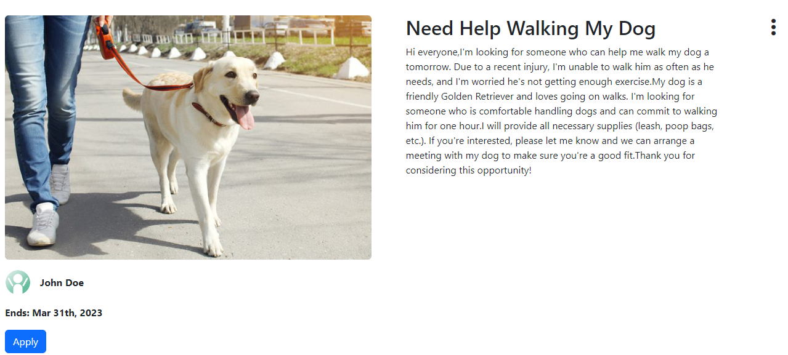
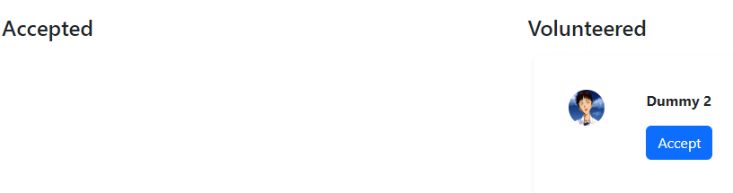
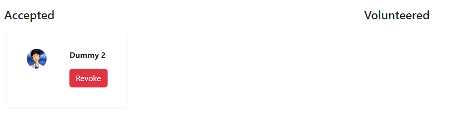
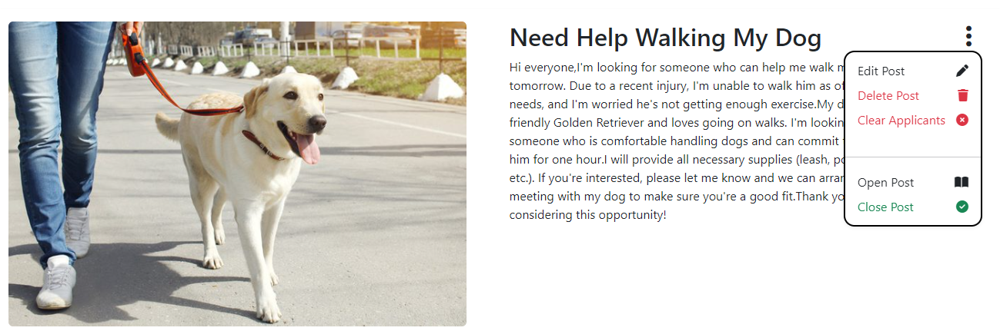
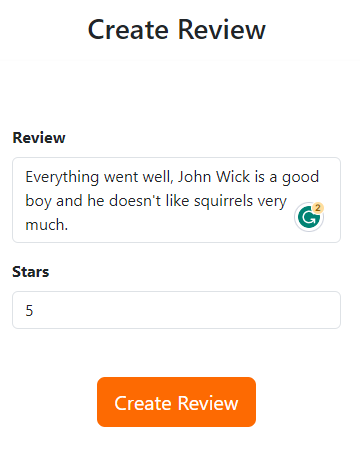
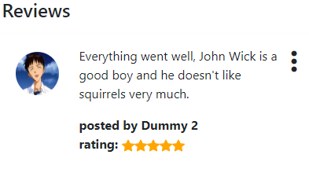

# NSCC - IT Web Programming - INFT3000

# Members

- Bruno Freitas,
- Omar Almasalmeh,  
- Joy Yewon Cho,
- Se Hwan Lee,
- Tynan Sampsel,
- Jason Sunnyassy

# Executive Summary
Lend a Hand is an app where you can ask or provide assistance with minor tasks. You can reach out to people for helping you with some task, or you can provide assistance to someone. 

# Scope
Lend a Hand is a service that requires registration. Each registered user will be granted a profile and the ability to create posts, ask for assistance, or provide assistance by applying to someone else posts.

# Features

## Register
To create a post or apply to someone else post you must be a registered user. To register you must inform:
- First Name
- Last Name
- Address
- Telephone Number
- Email Address
- Password

## Profile
Each registered user is provided with a profile page where you can see:
- Full Name
- Email Address
- Description
- How many times the user requested help
- How many times the user has helped someone
- The list of posts created by the user
- The list of posts that the user has helped someone
- The reviews given and received in each finalized post

You can access it through the dropdown menu in the header.

 

 ## Post
 Each registered user can create, edit and delete its own posts. The purpose of the post is to request assistance with a task.
 Non registered users can see the list of posts in the homepage, however, they cannot apply to it as a helper.
 Each post must contains:
 - Title
 - Location
 - Quantity of people needed for the task
 - A tag to classify the post
 - The expected date to perform the task
 - The description of the activity that needs to be done

 

 ## Apply to a post
 Each registered user can apply to help someone within a post. The registered user can filter for a specific tag in the homepage to seek a category he likes the most. To apply to a post, the registered user just need to click on "Apply" within a post. The post owner will see a list of people who have applied to his post and approve them or not. As a criteria, the post owner can check the users profile page and check the reviews, recent posts, [hands given and requested](#profile) or contact other users by email.

 

 

 

 ## Review
Each finalized post will have review fields, allowing users involved in the task to review each other. The review is a component of a post and the reviews can be accessed from the post list in the homepage or from the [profile page](#profile), from the post list.

Closing a post

Writing a review

Reading reviews

# Instructions

1. Git clone this repository.
2. Run `npm run dev`. This command will install all dependencies, initiate a local server and the app will open in the default browser.
3. We will need to include your ISP IP Address in our MongoDB firewall if you are testing this from home. From NSCC it should be working fine. 
4. We have a release on [https://lendahand.onrender.com/](https://lendahand.onrender.com/).
5. We are using MongoDB Atlas to host our data, as it is a shared resource, sometimes it could be really slow, taking up to 2 min to retrieve data.